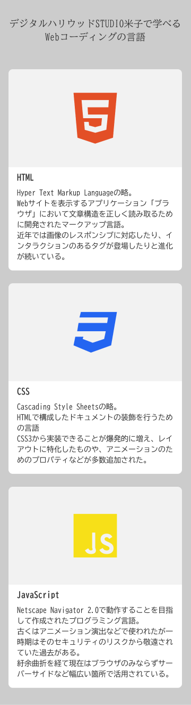
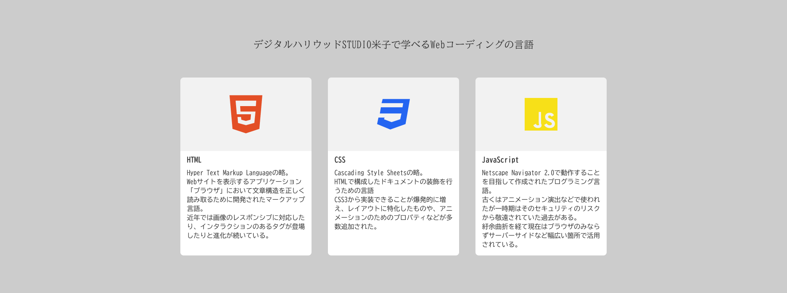

# 2024.1.12 (Fri) コーディング強化塾 課題

- 作成: 2023.12.28 S.Yabunaka

## 概要

見出し、画像、説明文の内容のカードを 3 枚縦に並べる。  
デスクトップ表示になったときは横に並ぶようにする。  

## 作業について諸注意

- デザインから `1px` 寸分なく実装するという必要はありません。  
  ニュアンスが変わらない実装であれば OK です。  
- モバイルファストで実装をしてください。  
- ブレイクポイントの設定は任意で OK です。  
- `HTML5`, `CSS3` で実装をしてください。  
- 提出前に必ず表示を確認してください。  

## デザイン

### モバイル表示

### PC 表示

## 仕様

### 共通仕様

#### 色

- 文字: `#333`
- 背景: `#ccc`
- カード背景: `#fff`

#### フォント

- 見出し 2: `BIZ UD Mincho`
- 見出し 3, 文章: `BIZ UD Gothic`

#### 画像比率

- `16:9`

#### 余白

- カード内テキスト周り余白(左右下): `16px`
- カード内要素間: `8px`

#### 他共通仕様

- 文章の行の高さ: `1.4`
- カード角丸: `8px`

### モバイル表示仕様

#### モバイル表示文字サイズ

- 見出し2: `18px`
- 見出し3: `16px`
- 文章: `14px`

#### モバイル表示余白

- セクション上下: `32px`
- 見出し2とカードグループ間: `48px`
- 左右余白: `16px`
- カード間上下余白: `24px`

#### 他モバイル表示仕様

- 最小画面幅: `320px`

### PC 表示仕様

#### PC 表示文字サイズ

- 見出し2: `24px`
- 見出し3: `18px`
- 文章: `16px`

#### PC 表示余白

- セクション上下: `92px`
- 見出し2とカードグループ間: `64px`
- カード間左右余白: `40px`

#### 他 PC 表示仕様

- コンテンツ最大幅: `1040px`

## 配布素材

- assets
  - comps
    - モバイル表示デザイン
      - `design_mobile.png`
    - PC 表示デザイン
      - `design_pc.png`
    - デザイン内仕様テキスト
      - `page_text.txt`
  - images
    - 画像ファイル 3 点
      - `img_css3.png`
      - `img_html5.png`
      - `img_javascript.png`
